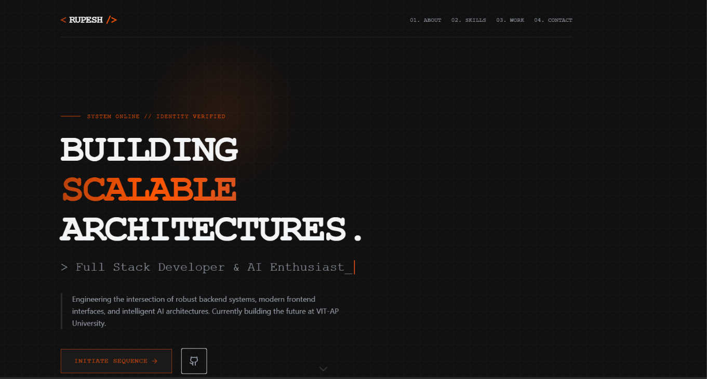

# 🚀 Rupesh's Developer Portfolio

A highly interactive, single-page developer portfolio designed with a raw, industrial aesthetic. Built to showcase my expertise as a Full Stack Developer & AI Enthusiast specializing in the MERN/PERN stack and generative AI architectures.

 

## ⚡ Live Demo
**https://rupesh-portfolio-ruby.vercel.app/**

## 🛠️ Tech Stack & Arsenal
This project is built from the ground up to be lightweight, incredibly fast, and visually striking.
- **Framework:** [React.js](https://reactjs.org/) (Create React App)
- **Styling:** [Tailwind CSS v3](https://tailwindcss.com/) (Custom rustic/industrial theme configurations)
- **Animations:** [Framer Motion](https://www.framer.com/motion/) (Scroll-triggered fade-ins, stagger effects, and interactive mouse trails)
- **Icons:** [Lucide React](https://lucide.dev/)

## ✨ Key Features
- **Industrial Aesthetic:** Custom-built UI utilizing dark charcoal/slate backgrounds contrasted with vibrant neon accents (orange, blue, emerald).
- **Dynamic Interactions:** Custom mouse-tracking glow effects and typing animations that make the UI feel alive.
- **Responsive Layout:** fully optimized Bento-box grid designs for mobile, tablet, and desktop viewing.
- **Optimized SEO:** Properly configured metadata for web crawlers and social media link sharing.

## 🚀 Getting Started Locally

To run this project on your local machine:

### 1. Clone the repository
```bash
git clone https://github.com/rupesh6314/your-repo-name.git
cd your-repo-name
```

### 2. Install Dependencies
```bash
npm install
```

### 3. Run the Development Server
```bash
npm start
```
The application will launch automatically at `http://localhost:3000`.

## 📁 Project Structure highlights
- `src/App.js` - The core application file containing all layout, logic, and Framer Motion animations.
- `tailwind.config.js` - Contains the custom color tokens (`industrial`, `neon-orange`, `rust`, etc.) and custom animations.
- `src/index.css` - Global stylesheet handling base styling and Tailwind directives.

## 📫 Connect with Me
- **GitHub:** [@rupesh6314](https://github.com/rupesh6314)
- **Email:** rupesh.2k5chandra@gmail.com

---
*Built with passion by Madhuvarsu Rupesh Chandra Bharadwaj.*
